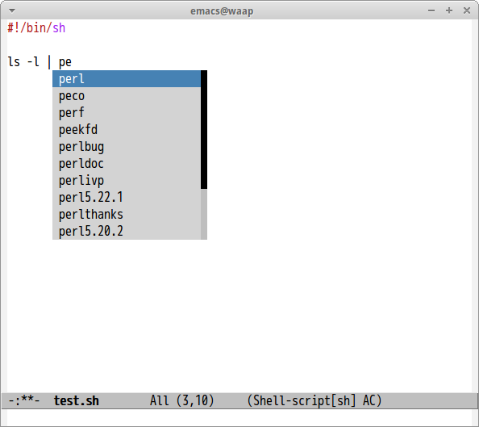

# ac-shell

[auto-comple](https://github.com/auto-complete/auto-complete/) source for shell commands. This is port of [company-shell](https://github.com/Alexander-Miller/company-shell).

## Screenshot



## Setup

``` lisp
(add-hook 'sh-mode-hook #'ac-shell-setup)
```
